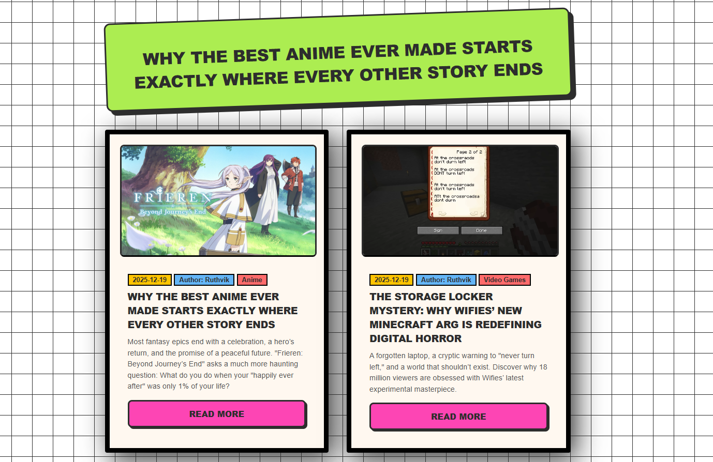
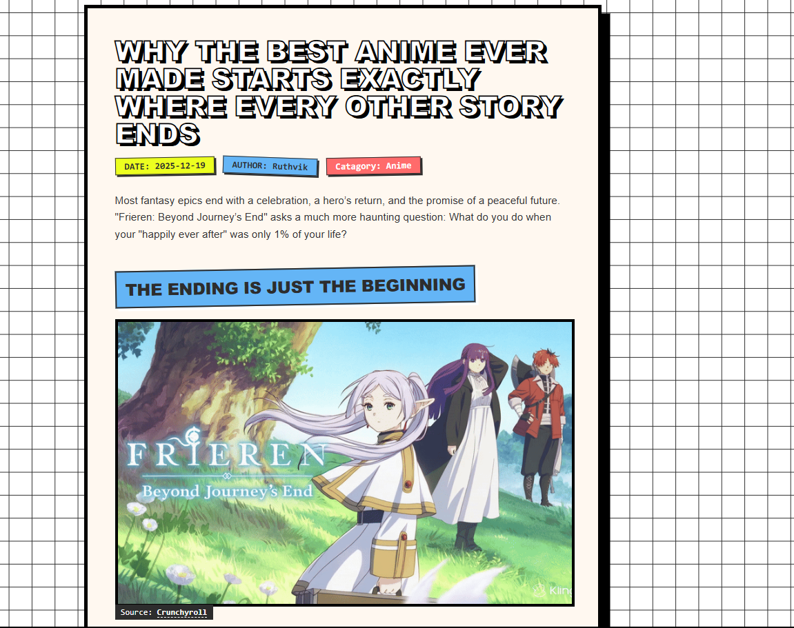
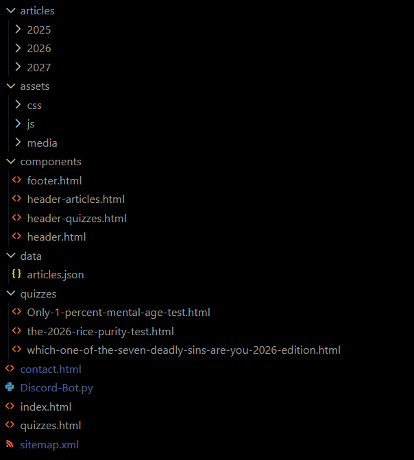

# **Discord Bot Controlled News Website: Professional News and Quiz Portal**

This platform is a high-performance web system designed to serve as a centralized hub for news, editorial articles, and interactive quiz modules. The project employs a lightweight, modular architecture that prioritizes scalability and search engine optimization without the dependency overhead of modern frontend frameworks.

## **Technical Architecture**

The platform is built on a Stateless Content Delivery model. Rather than utilizing a traditional database, the application leverages a structured JSON backbone to manage site-wide metadata, enabling dynamic content rendering on a static infrastructure.

### **1. Discord-Integrated Editorial System**

The platform operates as a community-centric news website where content delivery is bridged through a hybrid integration of static web infrastructure and Discord-driven control. While the structural core of the application logic resides in data/articles.json, the ecosystem is architected to support automated content workflows and real-time interaction between the web portal and community servers.

### **2. Component-Based UI Design**

To maintain a DRY (Don't Repeat Yourself) codebase, the project utilizes a custom JavaScript injection system located in assets/js/global.js. This script handles:

* Asynchronous fetching of global UI elements such as header.html and footer.html.  
* Context-aware navigation highlighting based on the current directory.  
* Unified error handling for failed asset loads.

### **3. Interactive Quiz Engine**

The quizzes directory contains sophisticated client-side modules that process user input through weighted algorithmic logic. These assessments, including the 2026 Rice Purity Test and Mental Age assessments, are designed to provide immediate feedback through DOM manipulation, ensuring a low-latency user experience.

## **System Components**

### **Frontend Specifications**

* HTML5/CSS3: Implements a mobile-first responsive design using CSS Grid and Flexbox for layout stability across devices.  
* Vanilla JavaScript: Handles all dynamic routing, content population, and quiz logic to ensure maximum browser compatibility and minimal load times.  
* SEO Integration: Utilizes a structured sitemap.xml and semantic HTML headers to enhance crawlability and indexation.

### **Community Integration (Discord-Bot.py)**

The project includes a Python integration built on the discord.py library. This bot serves as an automated liaison between the web portal and community servers. Technical capabilities include:

* Automated broadcasting of news updates parsed from the site metadata.  
* Real-time query responses for users searching the article database.  
* Event-driven logging for community interactions.

## **Bot Commands**

* !post: Initiates a multi-step interactive process to create and publish a new article. It handles headlines, excerpts, authors, categories, quotes, and media uploads (images or YouTube links).
* !setf <article_id>: Sets a specific article as the "Featured" article and updates the JSON data. 
* !remove <article_id>: Deletes a specific article from the JSON database and removes its corresponding HTML file. 
* !update-domain <new_domain>: Standardizes a new domain URL and updates both the domain and Brand Name across all supported file types (.html, .json, .xml, .js, .css, .py) in the project.

## **Project Directory Structure**

* /articles: Categorized HTML content optimized for read-heavy workloads.  
* /assets: Centralized repository for modular CSS, functional JavaScript, and optimized media assets.  
* /components: Reusable HTML fragments for consistent UI across sub-directories.  
* /data: The JSON-based metadata layer.  
* /quizzes: Logic-heavy interactive modules.  
* Discord-Bot.py: The Python-based community integration tool.

## **Deployment and Setup**

### **Web Portal**

The site is designed for static hosting. For deployment:

1. Ensure all paths in articles.json are relative to the root directory.  
2. Host the root directory on any standard web server or static hosting service.

### **Discord Integration**

The bot requires a Python 3.8+ environment:

1. Install requirements: pip install discord.py.  
2. Configure the BOT_TOKEN within the environment variables or the script configuration block.  
3. Execute via python Discord-Bot.py.